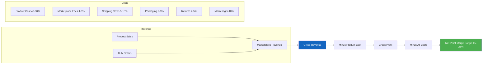

# Product Listing Guide - Commercial Vehicle Spare Parts
## Tokopedia and Marketplace SEO Best Practices for Truck Parts
**Last Updated:** April 8, 2026  
**Target:** Hino, Isuzu, Mitsubishi trucks, buses, heavy equipment

---

## 1. TITLE FORMULA FOR TRUCK PARTS

### 1.1 Basic Title Structure

**Formula:**
[NAMA PRODUK] + [MOBIL/TRUK] + [MEREK/TYPE] + [PART NUMBER] + [KUALITAS/KONDISI] + [GARANSI]

**Example Titles:**
- Bad: Injector Hino
- Good: Injector Assembly Truk Hino 500 Ranger J08E 095000-6593 Denso Quality - GARANSI 30 HARI
- Bad: Turbo Hino  
- Good: Turbocharger Hino 500 FM260 GT3576DL Euro 3 Original Garrett Type
- Bad: Piston Ring Hino
- Good: Piston Ring Set NPR Hino Lohan J08E 6 Silinder S1301-92080 - Made in Japan

### 1.2 Title Length Optimization

**Tokopedia:**
- Maximum: 120 characters (shown in search)
- Recommended: 70-100 characters
- Include: Product name, vehicle, part number
- Front-load keywords

**Shopee:**
- Maximum: 120 characters
- Hashtags allowed in title
- Use keywords that buyers search

**TikTok Shop:**
- Maximum: 80 characters (mobile-first)
- Shorter, punchier titles
- Emojis can help (1-2 max)

### 1.3 Brand-Specific Title Patterns

**Hino Parts:**
[Product] Truk Hino 500/Ranger/Dutro [Series] [Part Number] [Quality] [Warranty]

Examples:
- Injector Nozzle Truk Hino 500 J08E G3S12 Liwei Quality - Grosir
- Gasket Set Full Truk Hino Lohan FM260 J08E Non-TI NPR
- Alternator Dinamo Amper Truk Hino 500 J08E 24V 60A Original Type

**Isuzu Parts:**
[Product] Truk Isuzu [Series/NMR/ELF/Giga] [Engine] [Part Number] [Quality]

Examples:
- Injector Assembly Truk Isuzu ELF NKR/NMR 4HK1-TC G3S60 Denso
- Piston Ring Set Truk Isuzu NMR 81 4HK1 NPR Quality - Made in Japan
- Water Pump Truk Isuzu Giga 6HK1 8-97376-787-0 - Sparepart Diesel

**Mitsubishi Parts:**
[Product] Truk Mitsubishi [Canter/Fighter/Fuso] [Engine] [Part Number]

Examples:
- Injector Truk Mitsubishi Canter FE71 4M50 Euro 4 Bosch Type
- Piston Ring Set Truk Mitsubishi Fighter 6M60 NPR Japan Quality
- Turbocharger Truk Mitsubishi Fighter 6M60 TD06 Original Type

---

## 2. TOP 100 SEO KEYWORDS FOR TRUCK PARTS

### 2.1 Most Searched Keywords

**High Volume Keywords (1K+ searches/month):**
sparepart truk hino, jual sparepart truk, grosir sparepart truk jakarta, injector hino j08e, injector isuzu 4hk1, turbo hino j08e, piston ring hino, piston ring isuzu, filter oli hino, filter solar hino, alternator truk hino, starter motor hino, gasket set hino, water pump hino, kampas rem truk hino, kampas rem truk isuzu, kampas kopling truk, bearing truk, oli truk hino

**Medium Volume Keywords (500-1K searches/month):**
nozzle injector hino, nozzle injector isuzu, jual sparepart truk online, sparepart truk bekas, copotan truk hino, sparepart truk second, kabel body truk hino, dinamo starter hino, v belt truk hino, sparepart truk giga, sparepart truk canter, common rail hino, common rail isuzu, injektor truk hino, injektor truk isuzu, radiator truk hino

**Long-Tail Keywords (High Conversion):**
injector hino j08e euro 4 original, turbo hino 500 fm260 gt3576dl, piston ring set npr hino j08e original, sparepart truk hino jakarta utara, grosir sparepart truk sunter, jual sparepart truk tangerang, dinamo ampere truk hino j08e, water pump hino 500 series original, kampas rem truk hino fm260, gasket set hino lohan fm260

### 2.2 Keywords by Product Category

**Engine Components:**
injector, nozzle, piston, piston ring, liner, bearing, gasket, valve, camshaft, crankshaft, connecting rod, oil pump, water pump, timing gear, turbocharger

**Fuel System:**
injector, nozzle, fuel pump, common rail, fuel filter, diesel pump, injection pump

**Cooling System:**
radiator, water pump, thermostat, fan belt, hose radiator, intercooler

**Lubrication:**
filter oli, oli mesin, oil pump, oil cooler, filter solar

**Electrical:**
alternator, dinamo ampere, starter motor, dinamo starter, kabel body, sensor, ecu, relay, lampu truk

**Braking:**
kampas rem, brake lining, brake pad, brake shoe, wheel cylinder, master rem, brake drum

**Clutch:**
kampas kopling, clutch disc, clutch cover, bearing kopling, release bearing

---

## 3. ATTRIBUTE MAPPING PER MARKETPLACE

### 3.1 Tokopedia Attribute Optimization

**Required Attributes:**
- Merek: Aftermarket brand OR "Compatible"
- Model: Hino 500, Isuzu ELF, etc.
- Tipe: Engine model: J08E, 4HK1, etc.
- Kondisi: Baru / Bekas (Copotan) / Rekondisi
- Berat: Actual weight in grams
- Dimensi: L x W x H in cm
- SKU: Your internal code

**Recommended Attributes:**
- Original: Asli / OEM / Aftermarket
- Garansi: 7 hari / 14 hari / 30 hari / 6 bulan
- Asal Produk: Jepang / Korea / Taiwan / China / Lokal
- Kategori: Mesin / Rem / Kopling / Listrik

### 3.2 Shopee Attribute Optimization

**Key Differences from Tokopedia:**
- More focus on "Ship From" location
- "Variation" feature for multiple SKUs
- Product condition must match title

**SKU Naming Convention:**
[BRAND]-[CATEGORY]-[PARTNUMBER]-[VARIANT]

Example:
- HNO-ENG-J08EINJ-STD (Hino Engine J08E Injector Standard)
- ISZ-BRK-4HK1PAD-ORG (Isuzu Brake 4HK1 Pad Original)

### 3.3 TikTok Shop Attributes

**Unique Requirements:**
- Video thumbnail is CRITICAL
- Product must have physical video
- "Spark Ads" for promotion
- Live streaming capability

**TikTok Tags:**
spareparttruk hino500 isuzunmr jualsparepart grosirsparepart trukindonesia trukdiesel bengkeltruk mechanic truckparts

---

## 4. DESCRIPTION TEMPLATES BY PART CATEGORY

### 4.1 Engine Components Template

**[NAMA PRODUK]**

SPESIFIKASI:
- Brand: [Brand]
- Compatible Vehicle: [Truck Model]
- Engine Type: [Engine Model]
- OEM Part Number: [Part Number]
- Material: [Material specs]
- Condition: [New/Reconditioned/Copotan]

FITUR:
- High quality replacement
- Tested before shipping
- Direct fitment
- Quality assured

GARANSI:
- Garansi 30 hari untuk kerusakan pabrik
- Tidak termasuk salah instalasi
- Retur dalam 7 hari jika tidak cocok

CATATAN PENTING:
- Harap cocokkan part number sebelum membeli
- Foto dapat berbeda dari asli tapi spec sama
- Untuk pemesanan part number lain hubungi kami

### 4.2 Electrical Parts Template

SPESIFIKASI TEKNIS:
- Tegangan: [Volt - usually 24V for trucks]
- Amper: [Ampere rating]
- Compatible Engine: [Engine model]
- Original Part Number: [OEM number]

KETERANGAN:
- Barang [New/Recondition/Remanufaktur]
- Tested sebelum pengiriman
- Garansi 30 hari

COCOK UNTUK:
- [Truck Model 1]
- [Truck Model 2]
- [Truck Model 3]

### 4.3 Brake Parts Template

CERTIFIKASI:
- Lampirkan SNI jika wajib
- Material: Asbestos-free/Ceramic/Semi-metallic
- Quality: OEM/Aftermarket/Tier 1

KOMPATIBILITAS:
- Kampas rem set [Front/Rear/Full]
- Compatible dengan: [Truck models]
- Sistem rem: [Air/Hydraulic]

KEUNGGULAN:
- Performa pengereman optimal
- Tidak berisik
- Tahan panas
- Long life durability

PERINGATAN:
- Produk ini untuk kendaraan komersial
- Instalasi harus oleh mekanik berpengalaman
- Lakukan bedding-in setelah instalasi

### 4.4 Filter Template

SPESIFIKASI:
- Type: Oil Filter/Fuel Filter/Air Filter
- OEM Part Number: [Part number]
- Filter Media: Cellulose/Synthetic
- Recommended Change Interval: 5,000-10,000 km

GROSIR/MIN. ORDER:
- 5 pcs: Diskon 5%
- 10 pcs: Diskon 10%
- 50 pcs: Hubungi untuk harga khusus

### 4.5 Body and Chassis Template

SPESIFIKASI:
- Material: Steel/Aluminum/Plastic
- Finish: Chrome/Paint/Natural
- Dimensions: L x W x H
- Weight: X kg

PENGIRIMAN BODY PARTS:
- Khusus antar kargo/freight
- Packaging kayu/pallet untuk part besar
- Estimasi lama packing: 1-2 hari

---

## 5. SEO OPTIMIZATION STRATEGIES

### 5.1 Keyword Placement

**In Title:** Primary keyword near beginning
**In Description:** Use keywords naturally, 5-10 times
**In Attributes:** Fill all relevant attribute fields
**In Images:** Filename should include keywords

### 5.2 Internal Linking

**Cross-sell by mentioning:**
"Lihat juga:"
- Gasket set yang cocok untuk produk ini
- Filter oli untuk service rutin
- Oli mesin yang direkomendasikan
- Tools untuk instalasi

### 5.3 Reviews Management

**Encourage reviews by:**
- Following up after delivery
- Offering small discount on next purchase
- Responding to all reviews

---

## 6. IMAGE REQUIREMENTS

### 6.1 Tokopedia Image Guidelines

**Primary Image:**
- Size: min 500x500px, max 3000x3000px
- Background: White (preferred)
- Product centered and well-lit

**Secondary Images (max 8):**
- Image 2: Side/back view
- Image 3: Detail/close-up
- Image 4: Part number/label
- Image 5: Packaging
- Image 6: Application diagram

### 6.2 Image Naming for SEO

Examples:
- hino-injector-j08e-23670e0400-front-view.jpg
- isuzu-nozzle-4hk1-g3s60-detail.jpg
- mitsubishi-turbo-6m60-td06-side-view.jpg

---

## 7. PRICING STRATEGY

### 7.1 Competitive Pricing Formula

Cost Price: Rp X
Markup: 20-50% (depending on category)
Platform Fee: 1-4% (Tokopedia), 2-5% (Shopee)
Final Price: Rp Y

### 7.2 Psychological Pricing

**Effective Strategies:**
- End in 000 (Rp 975,000)
- Show Was/Now for discounts
- Free shipping threshold

---

## 8. PERFORMANCE METRICS

### 8.1 Key Metrics to Track

**Tokopedia:**
- Views vs conversion rate
- Average order value
- Return rate
- Response time (target <1 hour)
- Shop rating (target >4.8)

**Shopee:**
- Sales performance index
- Chat response rate
- On-time shipping rate
- Product quality score

### 8.2 Optimization Cycle

**Weekly:**
- Review low-performing listings
- Update descriptions based on questions
- Check competitor pricing

**Monthly:**
- Top seller analysis
- SEO keyword refresh
- Image quality audit

**Quarterly:**
- A/B test new titles
- Photography refresh
- Price strategy review

---

*Document Version: 2.0*  
*Last Updated: April 8, 2026*  
*Apply these templates and watch your search rankings improve!*

## Revenue and Cost Flow Analysis

