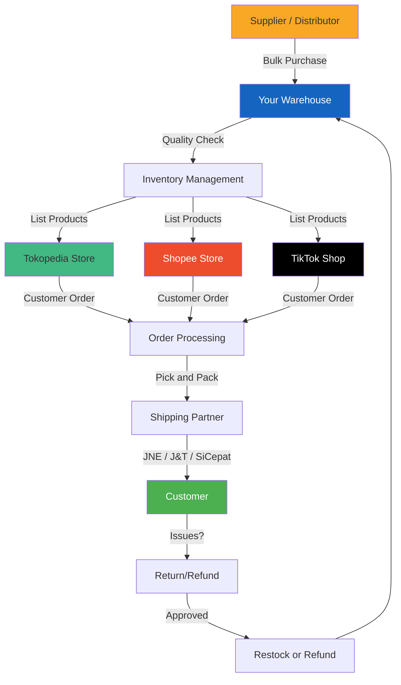

# Shipping and Fulfillment Guide - Commercial Vehicle Spare Parts
## Heavy Parts Logistics, Packaging, and Cost Optimization
**Last Updated:** April 8, 2026  
**Scope:** Tokopedia, Shopee, TikTok Shop shipping methods

---

## 1. SHIPPING COST ANALYSIS PER COURIER

### 1.1 Domestic Courier Comparison

| Courier | Max Weight | Max Dimension | Price per kg | Best For |
|---------|------------|---------------|--------------|----------|
| JNE YES | 50kg | 150x100x100cm | Rp 15K-25K | Medium parts, fast delivery |
| JNE REG | 70kg | 200x150x150cm | Rp 8K-12K | Heavy parts, standard |
| JNE JTR | 150kg | Unlimited | Rp 6K-8K | Very heavy parts |
| JNT | 50kg | 100x80x80cm | Rp 12K-18K | Medium parts |
| SiCepat BEST | 20kg | 80x60x60cm | Rp 10K-15K | Small-medium parts |
| Ninja Xpress | 50kg | 100x80x80cm | Rp 11K-16K | Medium parts |

For Parts over 50kg:
| Service | Max Weight | Cost Range |
|---------|----------|------------|
| JNE Cargo | 500kg+ | Rp 5K-8K/kg |
| Dakota Cargo | 1000kg+ | Rp 4K-7K/kg |
| Deliveree | Truck | Rp 300K-2M |

### 1.2 Inter-Island Shipping

| Destination | Courier | Cost per kg | Est. Days |
|-------------|---------|-------------|-----------|
| Surabaya | JNE | Rp 8K-12K | 2-4 |
| Medan | JNE | Rp 12K-18K | 3-5 |
| Makassar | JNE | Rp 18K-25K | 4-7 |
| Balikpapan | JNE | Rp 20K-28K | 5-8 |
| Kupang | JNE | Rp 28K-40K | 7-10 |

---

## 2. PACKAGING GUIDE BY PART CATEGORY

### 2.1 Fragile Parts

**Required Materials:**
- Bubble wrap (minimum 3 layers)
- Corrugated box (double wall for over 10kg)
- Foam inserts
- Fragile stickers

**Packaging Steps:**
1. Wrap item individually in bubble wrap
2. Place in box with foam padding (minimum 5cm)
3. Fill voids with packing peanuts
4. Double-box for items over Rp 1M value
5. Apply fragile stickers

**Examples:**
| Part Type | Inner Wrapping | Outer Box | Protection |
|-----------|----------------|-----------|------------|
| Injector | Bubble wrap + ziplock | Corrugated + foam | Double box |
| ECU | Anti-static bag + foam | Thick corrugated | Fragile sticker |
| Alternator | Bubble wrap corners | Standard box | Reinforce heavy side |
| Sensors | Individual boxes | Master carton | Foam layer |
| Glass/Headlamp | Foam sleeve + wrap | Double wall box | Fragile sticker |

### 2.2 Bulk/Heavy Parts

**Required Materials:**
- Cardboard sheets
- Stretch/pallet wrap
- Edge protectors
- Wooden pallet (for over 50kg)
- Strapping tape

**Packaging Steps:**
1. Clean part thoroughly
2. Apply rust inhibitor if steel
3. Wrap in corrugated sheets
4. Secure with stretch wrap
5. Add edge protectors
6. Strap to pallet for heavy items

**Examples:**
| Part Type | Weight | Packaging Method | Cost |
|-----------|--------|------------------|------|
| Cylinder Head | 15-25kg | Box with foam | Rp 50K-80K |
| Engine Block | 50-150kg | Pallet + crate | Rp 200K-500K |
| Transmission | 80-200kg | Pallet + strapping | Rp 250K-600K |
| Brake Drum | 10-20kg | Box + foam | Rp 40K-70K |
| Turbocharger | 5-10kg | Box with foam | Rp 30K-50K |

### 2.3 Hazmat Parts

**Battery Packaging (UN 2794/2796):**
- Acid-resistant tray
- Absorbent material
- B3 label
- Corrosion warning
- UN-compliant outer box

**Brake Fluid (Flammable):**
- Original sealed containers
- Individual plastic bags
- Separation from other items
- Flammable label

**Oil/Lubricant:**
- Original containers
- Cap seal intact
- Plastic bag wrap
- Absorbent paper

---

## 3. DIMENSIONAL WEIGHT CALCULATIONS

### 3.1 Volumetric Weight Formula

Standard Formula:
Volumetric Weight (kg) = (Length x Width x Height in cm) / Divider

Dividers by courier:
- JNE: 6,000
- JNT: 5,000
- SiCepat: 5,000

**Example:**
Part: Gasket set box (40cm x 30cm x 10cm), Actual weight: 500g

JNE calculation:
(40 x 30 x 10) / 6,000 = 12,000 / 6,000 = 2kg (volumetric)

Billed: 2kg (volumetric greater than actual)

### 3.2 Dimensional Weight Examples

| Part | Actual Dim | Actual Wt | Vol Wt (JNE) | Billed Wt |
|------|------------|-----------|--------------|-----------|
| Filter set | 25x20x15cm | 300g | 1.25kg | 1.25kg |
| Gasket set | 40x30x10cm | 500g | 2kg | 2kg |
| Brake pads | 30x20x8cm | 1kg | 0.8kg | 1kg |
| Radiator | 80x60x15cm | 5kg | 12kg | 12kg |

### 3.3 Optimization Strategies

**Reduce Volumetric Weight:**
1. Compact packaging (remove air gaps)
2. Flat packaging for flat parts
3. Vacuum bags where possible
4. Remove unnecessary packaging
5. Use custom box sizes

**Cost Savings Example:**
Original: 40x30x15 box = 3kg volumetric
Optimized: 35x25x12 box = 1.75kg volumetric

Savings per shipment: 1.25kg x Rp 12,000 = Rp 15,000

---

## 4. SHIPPING LABELING STANDARDS

### 4.1 Required Label Information

Standard Shipping Label:
- From: Nama Toko, Alamat, No. Telp
- To: Nama Penerima, Alamat, No. Telp
- Weight: X kg
- Dimensions: LxWxH cm
- Invoice: INV-XXX
- Barcode

### 4.2 Handling Labels

Must Use for:
| Label | When to Use |
|-------|-------------|
| FRAGILE | All electrical, sensors, glass |
| THIS SIDE UP | Liquids, fragile electronics |
| HEAVY | Items over 20kg |
| HANDLE WITH CARE | All mechanical parts |

---

## 5. FULFILLMENT WORKFLOW

### 5.1 Order Processing Timeline

Standard SLAs:
| Platform | Pickup SLA | Ship By |
|----------|------------|---------|
| Tokopedia | Next day | Day 1-2 |
| Shopee | Same day | Day 0-1 |
| TikTok | Next day | Day 1-2 |

**Internal Workflow:**
Hour 0-1: Order received, verify stock
Hour 1-2: Pick items from warehouse
Hour 2-3: Quality check + packaging
Hour 3-4: Label and stage for pickup
Hour 4-24: Courier pickup

### 5.2 Warehouse Layout

Zone Layout:
- Zone A: Receiving
- Zone B: Storage
- Zone C: Picking (fast-moving)
- Zone D: Packing
- Zone E: Shipping

**Fast-Moving Zone:**
- Best sellers within arm reach
- Eye-level shelving
- Quick access
- Same-day ship items

### 5.3 Pick List Generation

Sample Pick List:
- Order Number: TKP-12345
- Date: [Date]
- Items: SKU, Description, Qty, Check

---

## 6. SHIPPING PROBLEM RESOLUTION

### 6.1 Damaged Goods Handling

Prevention:
- Proper packaging per category
- Insurance for high-value items
- Photo documentation before ship
- Fragile labeling

Resolution Steps:
1. Request unboxing video from buyer
2. Review packaging adequacy
3. File insurance claim (if insured)
4. Offer partial refund or replacement
5. Update packaging standards

### 6.2 Lost Package Handling

Tracking Protocol:
1. Check courier tracking first
2. Contact courier CS (48h after expected)
3. File claim with platform (72h delay)
4. Escalate if over 7 days
5. Offer replacement or refund

Insurance Coverage:
| Platform | Auto Insurance | Max Claim |
|----------|---------------|-----------|
| Tokopedia | Up to Rp 1M | Rp 10M |
| Shopee | Up to Rp 2M | Rp 10M |

### 6.3 Delivery Failed/RTS

Reshipment Process:
1. Confirm correct address with buyer
2. Check if buyer wants to proceed
3. Generate new label (charge buyer for second)
4. Update order status
5. Monitor closely

---

## 7. COST OPTIMIZATION

### 7.1 Packaging Cost Reduction

Bulk Packaging Buying:
- Boxes: Buy 100+ for 30 percent discount
- Bubble wrap: 100m roll vs per-meter
- Tape: Bulk cases
- Labels: Print in-house after 100+ daily

### 7.2 Shipping Discount Programs

Tokopedia:
- Power Merchant: 5-15 percent discount
- Free shipping subsidy program
- Bulk label printing discounts

Shopee:
- Free shipping XTRA programs
- Coins cashback
- ShopeePay discounts

Direct Courier Contracts:
- JNE Corporate: Volume discounts
- Monthly minimum commitments

### 7.3 Consolidation Shipping

Multi-Item Orders:
- Combine into one box when possible
- Use single tracking number
- Clear Combined Package note
- Slight discount for buyer incentive

---

## 8. INTERNATIONAL SHIPPING

### 8.1 Import Documentation

Required for Parts from Abroad:
- PIB (Pemberitahuan Impor Barang)
- Packing list
- Commercial invoice
- Bill of lading/airway bill
- HS Code classification

### 8.2 Export Documentation

For Sales to Malaysia/Singapore:
- Export permit
- Certificate of origin
- Customs declaration
- Commercial invoice

---

## 9. SPECIAL HANDLING

### 9.1 Same-Day Delivery

Services:
- Gojek instant (Jabodetabek)
- GrabExpress instant
- Tokopedia NOW

Requirements:
- Order before 12:00
- Stock ready
- Packaging pre-staged
- Premium: Rp 15K-50K

### 9.2 COD Considerations

COD Handling:
- Verify buyer availability
- Clear delivery window
- Mobile payment devices
- Float money for change

---

## 10. FULFILLMENT METRICS

### 10.1 Key Performance Indicators

| Metric | Target | Industry Avg |
|--------|--------|--------------|
| Order processing time | under 4 hours | 12-24 hours |
| Same-day ship rate | over 50 percent | 20-30 percent |
| Damage rate | under 0.5 percent | 1-2 percent |
| Return rate | under 2 percent | 5-10 percent |

### 10.2 Measurement Tools

Tracking:
- Tokopedia/seller dashboard
- Shopee seller center
- Spreadsheet daily log
- Weekly trend analysis

---

*Document Version: 2.0*  
*Last Updated: April 8, 2026*  
*Proper packaging saves money and reputation!*

## Supply Chain Flowchart

