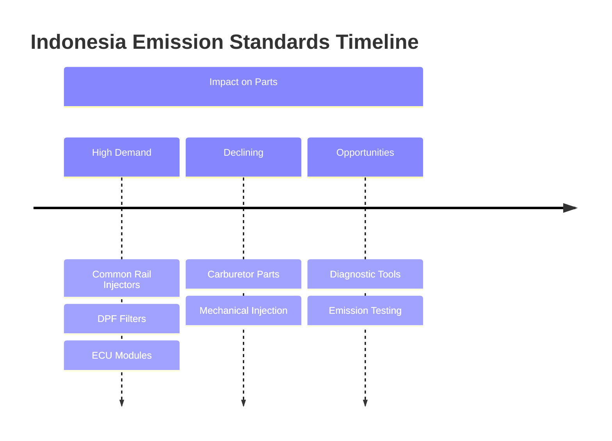

# EURO 2 TO EURO 4 TRANSITION GUIDE
## Indonesian Commercial Vehicle Emission Standards & Spare Parts Market | April 2026

**Research Date:** April 7, 2026  
**Focus:** Emission standard transition, parts differences, market opportunities for spare parts sellers

---

## 1. EURO 4 IMPLEMENTATION TIMELINE IN INDONESIA

### Key Dates

| Milestone | Date | Details |
|-----------|------|---------|
| **Regulation signed** | March 10, 2017 | Permen LHK No. P.20/MENLHK/SETJEN/KUM.1/3/2017 |
| **Gasoline vehicles** | September 2018 | Phase 1 implementation |
| **Diesel vehicles (original target)** | September 2020 | Phase 2 - delayed |
| **Diesel vehicles (actual)** | **April 7, 2022** | Official implementation for all diesel vehicles |
| **Future target: Euro 5** | 2025+ | Planned adoption |

### Why the Delay?

| Factor | Impact |
|--------|--------|
| **Pertamina fuel readiness** | Required sulfur ≤50ppm diesel production |
| **Manufacturer preparation** | Time needed to develop Euro 4 models |
| **Distribution infrastructure** | Ensuring fuel availability nationwide |
| **Testing equipment** | Kemenhub needed time to prepare type-testing facilities |

### Legal Basis

| Regulation | Purpose |
|------------|---------|
| **Permen LHK P.20/2017** | Original emission standard mandate |
| **Surat KLHK No S.786/2020** | Confirmed April 2022 implementation |
| **RUEN (Rencana Umum Energi Nasional)** | National energy plan backing Euro 4 |

---

## 2. EURO 2 vs EURO 4: TECHNICAL DIFFERENCES

### Emission Limits Comparison

| Parameter | Euro 2 (2005) | Euro 4 (2022) | Reduction |
|-----------|---------------|---------------|-----------|
| **CO (Carbon Monoxide)** | 4.0 g/kWh | 1.5 g/kWh | **62.5%** |
| **HC (Hydrocarbons)** | 1.1 g/kWh | 0.46 g/kWh | **58%** |
| **NOx (Nitrogen Oxides)** | 7.0 g/kWh | 3.5 g/kWh | **50%** |
| **PM (Particulate Matter)** | 0.15 g/kWh | 0.02 g/kWh | **87%** |

### Fuel Requirements

| Specification | Euro 2 | Euro 4 |
|---------------|--------|--------|
| **Sulfur content** | ≤500 ppm | **≤50 ppm** |
| **Cetane number** | No minimum | **Minimum 51** |
| **Benzene content** | ≤5% | **≤1%** |

### Key Technology Differences

| System | Euro 2 | Euro 4 |
|--------|--------|--------|
| **Fuel Injection** | Mechanical / EUI (Electronic Unit Injector) | **Common Rail** (high-pressure) |
| **Injection Pressure** | 200-400 bar | **1,600-2,500 bar** |
| **ECU Integration** | Basic ECU | **Integrated ECU + EDU** |
| **Emissions Control** | Minimal | **EGR / SCR / DPF** |
| **OBD (On-Board Diagnostics)** | Basic | **OBD-II with full monitoring** |

---

## 3. PARTS DIFFERENT BETWEEN EURO 2 AND EURO 4

### Major Component Changes

| Component | Euro 2 | Euro 4 | Change Impact |
|-----------|--------|--------|---------------|
| **Injector** | EUI / Mechanical | Common Rail (Denso/Bosch) | Higher precision, higher cost |
| **Fuel Pump** | Mechanical lift pump | High-pressure common rail pump | Complex, expensive |
| **ECU (Engine Control Unit)** | Basic control | Integrated ECU + EDU | More sensors, more codes |
| **Turbocharger** | Fixed geometry | Variable Geometry Turbo (VGT) | Better response, more complex |
| **EGR System** | None or basic | EGR valve + cooler | Reduces NOx, requires maintenance |
| **DPF (Diesel Particulate Filter)** | None | **Standard on most models** | Filters soot, requires regeneration |
| **SCR System** | None | **Selective Catalytic Reduction** | Uses AdBlue/DEF |
| **NOx Sensor** | None | **1-2 sensors per vehicle** | Monitors emissions |
| **Oxygen Sensor** | Basic | Wideband O2 sensor | Precise fuel control |
| **Rail Pressure Sensor** | None | **High-precision sensor** | Critical for common rail |

### Fuel System Differences

#### Euro 2: Mechanical / EUI System
```
[Fuel Tank] → [Lift Pump] → [Mechanical Pump] → [EUI Injectors]
                                          ↓
                                    [Return Line]
```

#### Euro 4: Common Rail System
```
[Fuel Tank] → [Electric Lift Pump] → [High-Pressure Pump] → [Common Rail] → [Injectors]
         ↑                                                            ↓
         └────────────────── [Return Line] ←─────────────────────────┘

Additional Components:
- Rail Pressure Sensor
- Pressure Control Valve
- Fuel Temperature Sensor
- Multiple Injection Events ( Pilot, Main, Post )
```

### Engine Management Differences

| Aspect | Euro 2 | Euro 4 |
|--------|--------|--------|
| **Injection timing** | Fixed or basic electronic | Fully electronic, variable |
| **Injection events** | Single injection | Multiple (pilot, main, post) |
| **Fuel quantity control** | Mechanical governor | ECU-controlled with feedback |
| **Diagnostics** | Limited codes | Full OBD-II with live data |
| **Sensor count** | 5-10 sensors | 15-25 sensors |

---

## 4. EURO 4-SPECIFIC PARTS IN HIGH DEMAND & LOW SUPPLY

### High-Demand, Low-Supply Parts

| Part | Demand Level | Supply Level | Price Range (OEM) | Notes |
|------|--------------|--------------|-------------------|-------|
| **Common Rail Injector** | HIGH | LOW | Rp 8-25M each | Most critical, fails often |
| **High-Pressure Pump** | HIGH | LOW | Rp 15-40M | Complex, needs precision |
| **DPF Filter** | MEDIUM | LOW | Rp 25-60M | Clogging common, expensive |
| **NOx Sensor** | MEDIUM | LOW | Rp 3-8M each | Often needs 2 per truck |
| **EGR Valve + Cooler** | MEDIUM | MEDIUM | Rp 5-15M | Carbon buildup issues |
| **Rail Pressure Sensor** | HIGH | MEDIUM | Rp 2-5M | Fails frequently |
| **VGT Actuator** | MEDIUM | LOW | Rp 8-20M | Electronic turbo control |
| **ECU/EDU Module** | MEDIUM | LOW | Rp 20-80M | Programming required |
| **AdBlue Injector** | MEDIUM | LOW | Rp 3-8M | SCR system component |
| **AdBlue Pump** | MEDIUM | LOW | Rp 10-25M | SCR system component |

### Parts with GOOD Aftermarket Availability

| Part | Aftermarket Brands | Price vs OEM |
|------|--------------------|--------------|
| **Common Rail Injector** | Bosch, Denso, Delphi | 50-70% of OEM |
| **Fuel Filter** | Fleetguard, Donaldson, Sakura | 30-50% of OEM |
| **Air Filter** | Donaldson, Fleetguard, VIC | 30-40% of OEM |
| **Oil Filter** | Fleetguard, Donaldson, Sakura | 40-60% of OEM |
| **NOx Sensor** | Bosch, Continental, aftermarket | 60-80% of OEM |

### Parts that are IMPORT-ONLY (No Local Manufacturing)

| Part | Origin | Lead Time |
|------|--------|-----------|
| **ECU/EDU Modules** | Japan, Germany | 2-4 weeks |
| **Common Rail Pumps** | Japan, Germany | 1-3 weeks |
| **DPF Filters** | Japan, China | 1-2 weeks |
| **VGT Turbochargers** | Japan, Korea | 1-3 weeks |
| **SCR Catalyst** | Japan, Germany | 2-4 weeks |

---

## 5. EURO 2 PARTS: CAN THEY STILL BE SOLD?

### Legal Status

| Aspect | Status |
|--------|--------|
| **Sale of Euro 2 parts** | **LEGAL** — No restrictions on selling |
| **Import of Euro 2 parts** | **LEGAL** — Can import for replacement market |
| **New vehicle registration** | **BLOCKED** — Only Euro 4+ since April 2022 |
| **Used vehicle import** | Age restrictions apply |

### Market Reality

| Scenario | Implication |
|----------|-------------|
| **Euro 2 trucks on road** | Estimated 3-4 million units still operating |
| **Parts demand** | HIGH — Existing fleet needs maintenance |
| **Price trend** | Stable to increasing (scarcity premium) |
| **Long-term outlook** | Gradual decline as fleet ages |

### What This Means for Sellers

| Action | Recommendation |
|--------|----------------|
| **Continue selling Euro 2 parts** | YES — Strong market for 10+ years |
| **Stock both Euro 2 and Euro 4** | YES — Diversify inventory |
| **Focus only on Euro 4** | NO — Missing large existing market |
| **Phase out Euro 2 parts** | NOT YET — Demand still strong |

---

## 6. COMMON EURO 4 ENGINE MODELS IN INDONESIA

### Hino (PT Hino Motors Manufacturing Indonesia)

| Engine Model | Application | Power | Key Features |
|--------------|-------------|-------|--------------|
| **J08E-WE** | Ranger FM, FG | 260 PS @ 2,500 rpm | Common rail, EGR |
| **J08E-WF** | Ranger FG, FL | 240 PS @ 2,500 rpm | Common rail, EGR |
| **N04C-T** | Dutro, Dyna | 150 PS | Common rail, DPF |
| **A09C-UP** | Ranger SG | 350 PS | Common rail, SCR |

#### Hino ECU/EDU Integration (Euro 4 Innovation)

> Hino's 4th generation ECU integrates **ECU + EDU** into a single unit for better synchronization between engine control and fuel injection.

**Key Euro 4 System Components:**
- Common rail injection system
- EGR (Exhaust Gas Recirculation)
- DPF (Diesel Particulate Filter)
- Integrated ECU-EDU module

### Isuzu

| Engine Model | Application | Power | Key Features |
|--------------|-------------|-------|--------------|
| **4HK1-TCN** | N-Series (NQR, NPS) | 190 PS | Common rail, EGR |
| **4HK1-TC** | N-Series, ELF | 155-190 PS | Common rail (since 2011) |
| **6HK1-TC** | Giga, Forward | 240-300 PS | Common rail, SCR |
| **6WG1-TC** | Giga Heavy | 350-400 PS | Common rail, SCR |

#### Isuzu Advantage

> **Isuzu had common rail technology since 2011** (Giga series) — 10+ years before Euro 4 mandate. This means:
> - Mature technology platform
> - Established parts supply chain
> - Better aftermarket availability vs competitors

### Mitsubishi Fuso (PT Krama Yudha Tiga Berlian Motors)

| Engine Model | Application | Power | Key Features |
|--------------|-------------|-------|--------------|
| **4M50-T3** | Canter FE71/74/75/78 | 140 PS | Common rail, SCR |
| **4M50-T4** | Canter FE | 150 PS | Common rail, DPF |
| **6M60-T** | Fighter, Super Great | 240-280 PS | Common rail, SCR |
| **6R10** | Super Great | 350-400 PS | Common rail, SCR, DPF |

#### Mitsubishi Euro 4 Implementation

> Mitsubishi prepared **29 commercial vehicle models** for Euro 4 compliance, including Canter, Fighter, and Super Great series with:
> - Common rail injection system
> - SCR (Selective Catalytic Reduction) with AdBlue
> - DPF (Diesel Particulate Filter) on selected models

### Toyota Dyna / Hino Dutro

| Engine Model | Application | Power | Key Features |
|--------------|-------------|-------|--------------|
| **N04C-T** | Dyna, Dutro | 150 PS | Common rail, DPF |
| **N04C-TR** | Dyna 150 | 136 PS | Common rail |
| **N04C-TV** | Dutro 300 | 150 PS | Common rail |

### UD Trucks

| Engine Model | Application | Key Features |
|--------------|-------------|--------------|
| **GH8** | Quester | SCR technology |
| **GE13** | Quon, Quester | SCR + DPF |

---

## 7. AFTERMARKET vs OEM: AVAILABILITY COMPARISON

### Common Rail Injectors

| Brand | OEM Part Number | OEM Price | Aftermarket Price | Availability |
|-------|-----------------|-----------|-------------------|--------------|
| **Mitsubishi Canter Euro 4** | 0445110927 (Bosch) | Rp 15-25M | Rp 8-15M | Both available |
| **Hino J08E** | Denso 095000-XXXX | Rp 12-22M | Rp 6-12M | Aftermarket limited |
| **Isuzu 4HK1** | Denso 095000-XXXX | Rp 10-20M | Rp 5-12M | Both available |
| **Toyota N04C** | Denso 23670-XXXX | Rp 12-25M | Rp 6-15M | OEM preferred |

### High-Pressure Pumps

| Brand | OEM Price | Aftermarket Price | Notes |
|-------|-----------|-------------------|-------|
| **Hino J08E** | Rp 25-40M | Rp 15-25M | Limited aftermarket |
| **Isuzu 4HK1** | Rp 20-35M | Rp 12-22M | Good availability |
| **Mitsubishi 4M50** | Rp 25-45M | Rp 15-28M | Bosch aftermarket |

### DPF Filters

| Brand | OEM Price | Aftermarket Price | Notes |
|-------|-----------|-------------------|-------|
| **Hino** | Rp 40-80M | Rp 25-50M | Import from China/Japan |
| **Isuzu** | Rp 35-70M | Rp 20-45M | Good availability |
| **Mitsubishi** | Rp 45-90M | Rp 30-55M | Limited aftermarket |

### NOx Sensors

| Brand | OEM Price | Aftermarket Price | Notes |
|-------|-----------|-------------------|-------|
| **Bosch** | Rp 5-8M | Rp 3-5M | Cross-compatible |
| **Denso** | Rp 4-7M | Rp 2.5-4M | Model-specific |
| **Continental** | Rp 4-6M | Rp 2.5-4M | Good availability |

### Where to Source Aftermarket Euro 4 Parts

| Source | Price Level | Quality | Lead Time |
|--------|-------------|---------|-----------|
| **Tokopedia/Shopee** | 40-70% of OEM | Varies (check seller rating) | 1-7 days |
| **Alibaba** | 30-50% of OEM | Varies (MOQ required) | 2-4 weeks |
| **Direct Import (China)** | 30-40% of OEM | Good (if verified supplier) | 2-4 weeks |
| **Authorized Dealer** | 100% (OEM price) | Guaranteed | 1-3 weeks |
| **Bengkel Spesialis** | 60-80% of OEM | Varies | Same day (if stock) |

---

## 8. EURO 2 TRUCK POPULATION: MARKET SIZE

### Commercial Vehicle Statistics (2023-2024)

| Category | Units | Notes |
|----------|-------|-------|
| **Total commercial vehicles** | 5,934,803 units | As of May 2023 |
| **Trucks (mobil barang)** | ~4,000,000 units | Estimated |
| **Buses** | 293,991 units | Nationwide |

### Estimated EURO 2 Fleet

| Metric | Estimate |
|--------|----------|
| **Pre-Euro 4 trucks (before April 2022)** | ~3,000,000 - 3,500,000 units |
| **Annual new truck sales** | ~50,000 - 80,000 units |
| **Euro 4 trucks sold (2022-2025)** | ~150,000 - 250,000 units |
| **Euro 2 trucks remaining** | **3+ million units** |

### Regional Distribution of Commercial Vehicles

| Island | Units | Top Province | Units |
|--------|-------|--------------|-------|
| **Java** | 2,942,368 (49%) | East Java | 773,842 |
| | | Jakarta | 761,329 |
| **Sumatra** | 1,548,859 | North Sumatra | 309,598 |
| **Kalimantan** | ~400,000 | East Kalimantan | Mining operations |
| **Sulawesi** | ~300,000 | South Sulawesi | Agriculture logistics |

### Implications for Spare Parts Market

| Factor | Impact |
|--------|--------|
| **Euro 2 parts demand** | STRONG for next 10-15 years |
| **Fleet replacement rate** | 5-8% annually |
| **Full Euro 4 fleet** | Estimated 2040+ |
| **Dual inventory needed** | Yes, for next decade |

---

## 9. CERTIFICATION & DOCUMENTATION FOR EURO 4 PARTS

### SNI (Standar Nasional Indonesia) Certification

#### Currently Mandatory SNI for Automotive Parts

| Component | SNI Standard | Status |
|-----------|--------------|--------|
| **Tires (passenger car)** | SNI 0098-2012 | Mandatory |
| **Tires (light truck)** | SNI 0100-2012 | Mandatory |
| **Tires (truck & bus)** | SNI 0099-2012 | Mandatory |
| **Tires (motorcycle)** | SNI 0101-2012 | Mandatory |
| **Wheels (passenger car)** | SNI 4658:2008 | Mandatory |
| **Wheels (commercial)** | SNI 1896:2008 | Mandatory |
| **Safety glass (tempered)** | SNI 15-0048-2005 | Mandatory |
| **Safety glass (laminated)** | SNI 15-1326-2005 | Mandatory |
| **Helmets** | SNI 1811:2007 | Mandatory |
| **Lubricants** | SNI 7069 series | Mandatory |

#### Currently NOT Mandatory SNI for Euro 4 Parts

| Component | SNI Status |
|-----------|------------|
| **Common rail injectors** | Not mandatory |
| **Fuel pumps** | Not mandatory |
| **ECU/EDU modules** | Not mandatory |
| **DPF filters** | Not mandatory |
| **NOx sensors** | Not mandatory |
| **Brake linings** | No longer mandatory |

### Import Documentation Requirements

| Document | Purpose | Issued By |
|----------|---------|-----------|
| **Surat Keterangan Impark (SKI)** | Import permit | Ministry of Trade |
| **API (Angka Pengenal Importir)** | Importer registration | Ministry of Trade |
| **NIB (Nomor Induk Berusaha)** | Business registration | OSS (Online Single Submission) |
| **HS Code verification** | Customs classification | Customs/Bea Cukai |
| **Invoice & Packing List** | Transaction proof | Supplier |
| **Bill of Lading/Air Waybill** | Shipping document | Carrier |

### Parts That May Require Special Import Permits

| Category | Additional Requirement |
|----------|------------------------|
| **Electronics (ECU, sensors)** | May require POSTEL certification if wireless |
| **Engine parts** | Standard import permit |
| **Emissions-related parts** | No special permit required |

### Documentation to Keep for Compliance

| Document | Purpose |
|----------|---------|
| **Supplier invoice** | Proof of authenticity for disputes |
| **Certificate of Origin (COO)** | Country of manufacture proof |
| **Quality certificates** | OEM specifications compliance |
| **Import documents** | Customs clearance proof |
| **Warranty cards** | Buyer assurance |

---

## 10. MARKET OPPORTUNITIES FOR SPARE PARTS SELLERS

### High-Margin Euro 4 Parts to Stock

| Part | Margin Potential | Competition | Recommendation |
|------|------------------|-------------|----------------|
| **Common rail injectors (aftermarket)** | 30-50% | Medium | HIGH PRIORITY |
| **NOx sensors (aftermarket)** | 40-60% | Low | HIGH PRIORITY |
| **Rail pressure sensors** | 50-80% | Low | HIGH PRIORITY |
| **AdBlue pumps** | 30-50% | Low | STOCK |
| **EGR valves** | 40-60% | Medium | STOCK |
| **DPF filters (aftermarket)** | 30-50% | Low | STOCK (capital-intensive) |
| **ECU/EDU (remanufactured)** | 50-100% | Very Low | SPECIALIZE |

### Euro 2 Parts with Sustained Demand

| Part | Market Outlook | Strategy |
|------|----------------|----------|
| **Mechanical injectors** | Stable for 5-10 years | Maintain stock |
| **Mechanical fuel pumps** | Declining but steady | Reduce gradually |
| **Engine overhaul kits** | Strong (aging fleet) | Stock heavily |
| **Transmission parts** | Strong | Stock |
| **Suspension parts** | Strong | Stock |
| **Brake linings** | Strong | Stock |

### Pricing Strategy

| Category | Euro 2 Parts | Euro 4 Parts |
|----------|--------------|--------------|
| **OEM** | Lower (legacy pricing) | Higher (new tech) |
| **Aftermarket** | Widely available | Limited, premium pricing |
| **Margin recommendation** | 20-30% | 30-50% |

### Sourcing Recommendations

| Part Type | Best Source | Lead Time |
|-----------|-------------|-----------|
| **OEM Euro 4 parts** | Authorized distributors | 1-3 weeks |
| **Aftermarket Euro 4 injectors** | China (verified suppliers), Alibaba | 2-4 weeks |
| **Remanufactured injectors** | China, Poland | 2-4 weeks |
| **Sensors (NOx, O2, Rail)** | China, Taiwan | 1-2 weeks |
| **DPF filters** | China, Japan | 2-3 weeks |
| **Euro 2 parts** | Local distributors, Japan surplus | Same day - 1 week |

---

## 11. COMMON EURO 4 PROBLEMS & PARTS OPPORTUNITIES

### Frequent Euro 4 System Failures

| Problem | Cause | Part Required | Frequency |
|---------|-------|---------------|-----------|
| **Engine derating (power loss)** | DPF clogged | DPF filter or cleaning | High |
| **AdBlue warning** | SCR system fault | AdBlue pump, injector, NOx sensor | Medium |
| **Check engine light** | Sensor failure | Various sensors | High |
| **Rough idle** | Injector imbalance | Common rail injector | Medium |
| **Won't start** | Rail pressure fault | High-pressure pump, rail sensor | Medium |
| **Black smoke** | Injector failure or EGR stuck | Injector, EGR valve | Medium |
| **High fuel consumption** | Injector leak, sensor fault | Injector, sensors | Low |

### Maintenance Parts with Recurring Demand

| Part | Replacement Interval | Annual Demand Potential |
|------|---------------------|------------------------|
| **Fuel filter (common rail)** | 10,000-20,000 km | HIGH |
| **AdBlue filter** | 40,000 km | MEDIUM |
| **NOx sensor** | 100,000 km or failure | MEDIUM |
| **EGR valve cleaning** | 50,000 km | HIGH (service) |
| **DPF cleaning** | 150,000 km | MEDIUM (service) |
| **Common rail injector** | 200,000+ km or failure | MEDIUM |

---

## 12. QUICK REFERENCE: PART NUMBERS

### Common Rail Injectors

| Vehicle | Engine | OEM Part Number | Aftermarket Option |
|---------|--------|-----------------|-------------------|
| Mitsubishi Canter Euro 4 | 4M50 | 0445110927 (Bosch) | Bosch aftermarket |
| Hino Ranger Euro 4 | J08E | Denso 095000-XXXX | Denso aftermarket |
| Isuzu N-Series Euro 4 | 4HK1 | Denso 095000-XXXX | Denso aftermarket |
| Toyota Dyna Euro 4 | N04C | Denso 23670-XXXX | OEM preferred |

### NOx Sensors

| Brand | Part Number Type | Price Range |
|-------|------------------|-------------|
| Bosch | 0 281 004 XXX | Rp 3-6M |
| Denso | 196500-XXXX | Rp 3-5M |
| Continental | 5WK9 XXXX | Rp 3-5M |

### DPF Filters

| Brand | Application | OEM Price Range |
|-------|-------------|-----------------|
| Hino | J08E engine | Rp 40-80M |
| Isuzu | 4HK1 engine | Rp 35-70M |
| Mitsubishi | 4M50 engine | Rp 45-90M |

---

## APPENDIX: Key Links & Resources

| Resource | URL |
|----------|-----|
| **Permen LHK P.20/2017** | KLHK website |
| **Hino Euro 4 Training** | Available via Scribd |
| **Denso Common Rail Catalog** | Denso official website |
| **Bosch Diesel Systems** | Bosch Automotive website |
| **SNI Certification Info** | BSN (Badan Standarisasi Nasional) |

---

*Report Generated: April 7, 2026*  
*Research Method: Web Search + Content Extraction from Government Sources, Manufacturer Training Documents, and Industry Publications*

## Euro 4 Implementation Timeline



